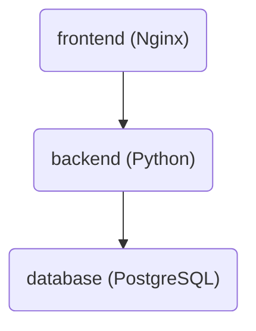
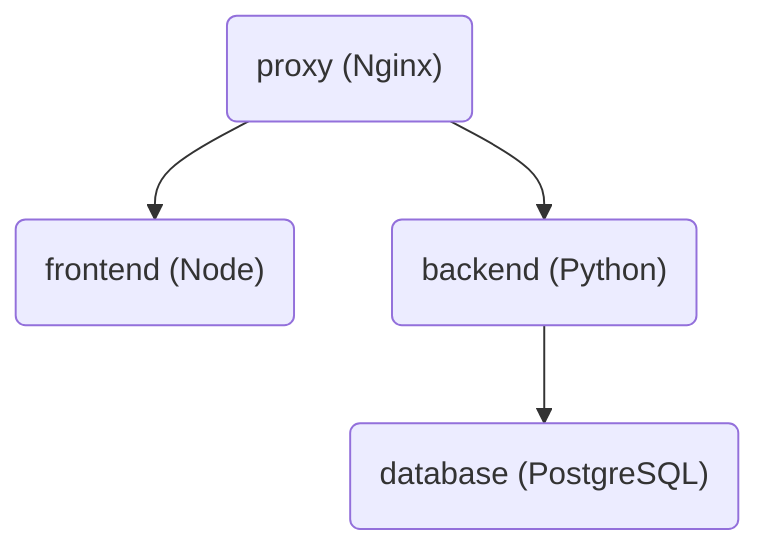

Weight Logger
===

Weight Logger is a simple web app for tracking body weight. Weight measurements
are kept in a table, and graphed together with a goal weight. The table looks
like this:


And the graph looks like this:


These screenshots are from sample data available in a running version of the
app found here: [Weight Logger](https://www.alexan.org/weight-logger/). You're
welcome to try it out. Sample data can be found by logging in as user
`Garfield` password `foobar`.  Or, you can create an account by clicking _Sign Up_.

Usage
---

Click _Table_ and _Graph_ in the upper right to switch between viewing the
table and graph.

The graph shows goal weight as a green dashed line. To change the goal weight,
click the username (_Garfield_) and then _Settings..._ to bring up the Settings
dialog.


The Settings dialog can also be used to change the units used to display
weights, to either pounds or kilograms.

To add a weight measurement, click _Add_ to bring up the Add Entry dialog.


Edit and delete entries by clicking on _Edit_ and _Delete_ to the right of each entry.

To download all entries to a CSV file click _Download_.

To upload entries from a CSV file click _Upload_.

To delete all entries click _Delete All_.

Installing
---

Weight Logger was developed and tested on a Debian machine, running Debian 11
Bullseye, but should work on any Linux distro that supports Python 3.9 and
Docker 20.10.

Start by cloning the repo:

```sh
git clone https://github.com/stalexan/weight-logger.git
```

Weight Logger has a command line administration tool called `wl-admin` that can
be used to install Weight Logger. To get it running on a Debian based machine,
install its dependencies with:

```sh
apt-get install python3-validators
```

Or on a non-Debian based machine, the dependencies can be installed with pip,
in a Python virtualenv:

```sh
(mkdir -p ~/.venv && cd ~/.venv && python3 -m venv weight-logger)
source ~/.venv/weight-logger/bin/activate
pip install pip-tools
cd weight-logger
pip-sync
```

There are two types of installs, or deployments: development and production.
Here we'll do a production deployment. The next section on
[Development](#development) will do a development deployment.

The following command will initialize a simple production deployment, that runs
over HTTP. Substitute the name of your server in place of HOMEPAGE (e.g.  `http://www.myserver.com`):

<pre>
wl-admin init prod --homepage HOMEPAGE --http-host-port 80
</pre>

Weight Logger will then be available at the URL `http://www.myserver.com`. 

This is the simplest type of production deployment, although not recommended,
since its just HTTP and passwords and authentication tokens are sent in the
clear. It can be a good way to get started and try things out, though.

A proxy is needed to provide encryption, using HTTPS and TLS. Weight Logger
doesn't provide a proxy for this, but a web server such as Nginx can be
configured as one, with Let's Encrypt certificates.

Let's assume we have a TLS proxy on the machine that runs Weight Logger, and
it redirects traffic to `https://www.myserver.com/weight-logger` to port 8080.
The command to configure Weight Logger would be:

<pre>
wl-admin init prod --homepage https://www.myserver.com/weight-logger --http-host-port 8080
</pre>

The `--http-host-port` parameter configures Weight Logger to listen on port
8080 of the host machine.

Another possibility for a TLS proxy would be to have it run inside another
Docker container.  For this, use the `--network NETWORK` parameter instead of
`--http-host-port`. Set `NETWORK` to the name of the Docker network the TLS
proxy runs on. This will cause Weight Logger use the same network, and be
visible to the proxy:

<pre>
wl-admin init prod --homepage https://www.myserver.com/weight-logger --network NETWORK
</pre>

The TLS proxy in the Docker container should be configured to forward
`https://www.myserver.com/weight-logger` to `http://frontend/`.

Next we want to build the Docker containers. This is done with:

<pre>
wl-admin docker build
</pre>

Now we can start the containers with:

<pre>
wl-admin docker up
</pre>

Weight Logger is now running.

Let's create a user called Garfield, with a goal weight of 110 lb:

<pre>
wl-admin user add dev --english --goal 110 Garfield
</pre>

The parameter `--english` says to use pounds as units instead of kilograms (the
default), and `--goal 110` sets the initial goal weight to be 110 pounds.

Weight Logger is now ready for use, and user Garfield can login and start
adding weight measurements.

Development
---

In the previous section we created a production deployment. In this section
we'll create a development deployment.

The production deployment we just created has 3 Docker containers:



The containers are:

* `frontend`: An Nginx container that surfaces the frontend. The frontend is
  a React app that's been turned into static files using `npm build`.  The
  `frontend` container also proxies calls to the `backend` container. Any URL
  that starts with `backend/` is forwarded to the `backend` container.
* `backend`: A Python container that surfaces the backend. The backend is
  a REST application written in Python using FastAPI.
* `database`: A PostgreSQL container that runs the database, where user and
  weight entry data is stored.

The development deployment that we'll now create has 4 Docker containers:



The `backend` and `database` containers are the same as those from the
production deployment. The `frontend` containers is now a Node container,
though, instead of Nginx. Node runs the React app directly, where
it can be edited and rebuilt on the fly.

The `proxy` container is an Nginx container that proxies HTTP calls to either
`frontend` or `backend`, depending on the URL. URLs that start with `backend/` are
forwarded to the `backend` container, while all others go to the `frontend`
container.

We can configure a development deployment with:

<pre>
wl-admin init dev --homepage http://localhost --http-host-port 80
</pre>

This will make Weight Logger available at the URL `http://localhost`. 

To build and start the containers we use the same commands as before:

<pre>
wl-admin docker build
wl-admin docker up
</pre>

For a development deployment, the servers within the `frontend` and `backend`
containers need to be started manually. To start the `frontend` Node server:

<pre>
docker exec -it wl-frontend-dev bash
npm start
</pre>

And, to start the `backend` FastAPI server:

<pre>
docker exec -it wl-backend-dev bash
./run-server
</pre>

Administration
---

The `wl-admin` command-line tool can be used to administer Weight Logger. It has support for:

* Initializing a deployment with [`wl-admin init`](docs/wl-admin-init.md).
* Managing Docker containers with [`wl-admin docker`](docs/wl-admin-docker.md).
* Managing users with [`wl-admin user`](docs/wl-admin-user.md).
* And, backing up and restoring the database with [`wl-admin db`](docs/wl-admin-db.md).
